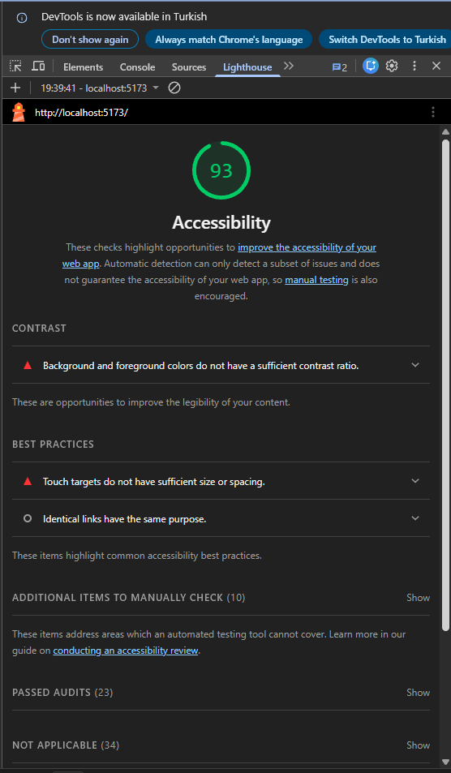
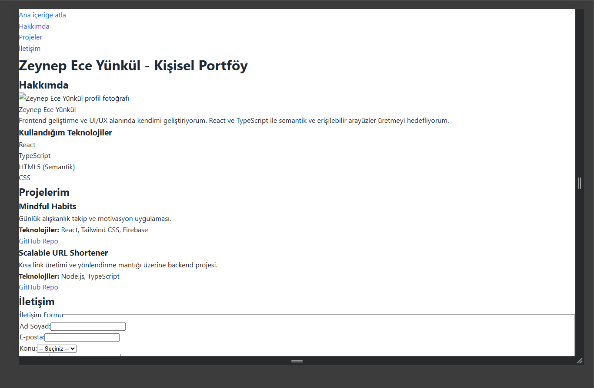
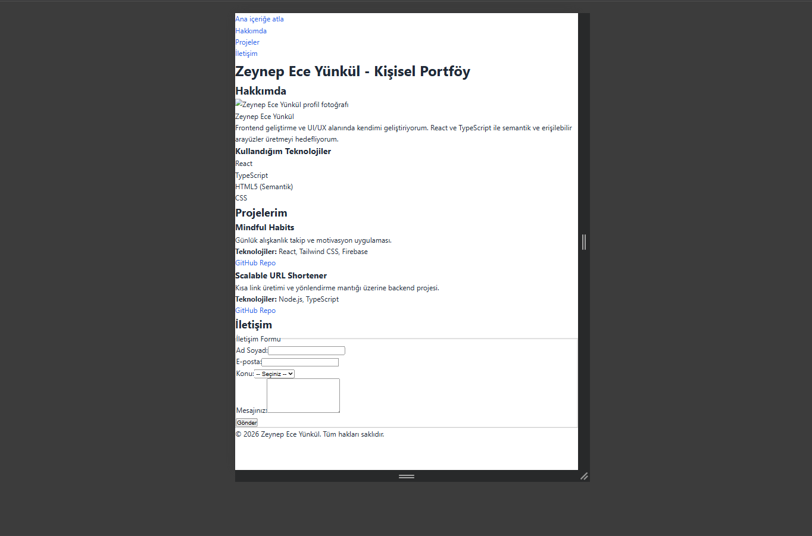
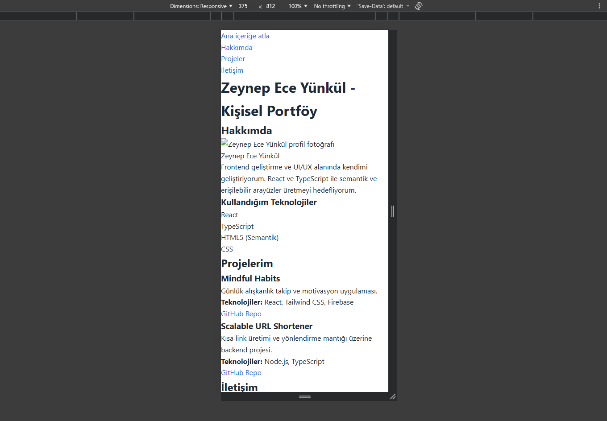

# Web LAB-1 - Hello Project

## Hakkında
Bu proje, Web Tasarımı ve Programlama dersi LAB-1 kapsamında Vite + React + TypeScript kullanılarak oluşturulmuştur.

## Geliştirici
- **Ad Soyad:** Zeynep Ece Yünkül
- **Öğrenci No:** 235542004

## Kullanılan Teknolojiler
- React
- TypeScript
- Vite

## Kurulum
```bash
npm install
```

## Lighthouse Accessibility


---

# Responsive Tasarım

## Design Tokens
Bu projede renkler, spacing, border-radius, typography ve shadow değerleri 
`src/styles/tokens.css` dosyasında merkezi olarak tanımlanmıştır. 
Tüm sabit (hard-coded) değerler kaldırılarak `var(--...)` değişkenleri kullanılmıştır.

## Fluid Typography
Başlık ve metin boyutları `clamp()` kullanılarak akışkan (fluid) hale getirilmiştir.
Bu sayede font boyutları ekran genişliğine göre dinamik olarak değişmektedir.

## Layout Kararları

### Flexbox (Navigation)
- Header navigasyonu Flexbox ile yatay hizalanmıştır.
- 768px altında menü dikey stack olacak şekilde düzenlenmiştir.

### Grid (Projeler)
- Desktop: 3 kolon
- Tablet (≤1024px): 2 kolon
- Mobile (≤768px): 1 kolon

## LAB-3 Responsive Screenshots

### Desktop


### Tablet


### Mobile

